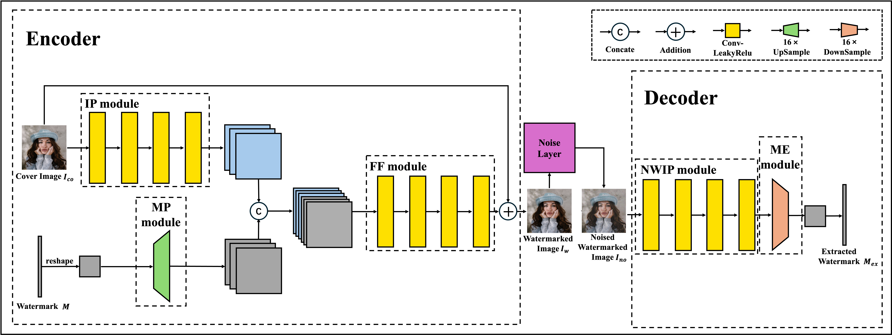

# 🏷️ Lightweight-Mark

<p align="center">
  <b>✨ Rethinking Deep Learning-Based Watermarking ✨</b>
</p>

<p align="center">
  <a href="https://openreview.net/pdf?id=ag3uveGZCb"></a>
  <a href="#"></a>
  <a href="#"></a>
  <a href="#license"></a>
</p>

<p align="center">
  <b>👨‍🔬 Yupeng Qiu, Han Fang*, and Ee-Chien Chang</b>
</p>

<p align="center">
  <i>🎉 Accepted at ICML 2025 🎉</i>
</p>

---

## 🌟 Overview

**Lightweight-Mark** is a lightweight yet robust deep learning-based watermarking framework. Unlike existing methods that rely on heavy encoder-decoder architectures, we demonstrate that a simple, shallow lightweight framework can achieve competitive robustness while significantly reducing model complexity.

### 📦 What This Repository Provides

- 🔧 A **lightweight encoder-decoder** architecture for image watermarking
- 🎯 Two novel training strategies: **DO** (Decoding-Oriented surrogate loss) and **PH** (Detachable Projection Head)
- 💾 **Pretrained checkpoints** for various noise conditions
- 🛡️ A comprehensive **noise simulation layer** supporting multiple image distortions

### ⚡ Key Features

| Feature | Description |
|---------|-------------|
| 🪶 **Lightweight** | Simple CNN architecture with minimal parameters |
| 🔢 **64-bit Capacity** | Embeds 64-bit messages into images |
| 🎨 **High Fidelity** | Maintains high PSNR between cover and stego images |
| 💪 **Robust** | Withstands JPEG compression, filtering, noise, and more |

---

## 🏗️ Architecture

<p align="center">
  
</p>

### 🎓 Training Methods

####  DO (Decoding-Oriented Surrogate Loss)
-  Directly optimizes the decoder output for correct bit classification
-  Simple and efficient training without additional network components

####  PH (Detachable Projection Head)
-  Adds a projection head during training to improve performance
-  The projection head is dropped during inference for efficiency

---

## 🛡️ Supported Noise Attacks

The framework includes differentiable approximations for various image distortions:

| Noise Type | Abbreviation | Description |
|------------|--------------|-------------|
|  JPEG Compression | `Jpeg` / `JpegTest` | Simulates JPEG quality degradation |
|  Median Filter | `MF` | Applies median filtering |
|  Gaussian Filter | `GF` | Applies Gaussian blur |
|  Gaussian Noise | `GN` | Adds Gaussian noise |
|  Salt & Pepper | `SP` | Adds salt and pepper noise |
|  Dropout | `Dropout` | Randomly drops pixels |
|  Identity | `Identity` | No distortion (baseline) |

---

## 📥 Installation

```bash
# Clone the repository
git clone https://github.com/your-username/Lightweight-Mark.git
cd Lightweight-Mark

# Install dependencies
pip install torch torchvision numpy
```

### 📋 Requirements
- 🐍 Python >= 3.8
- 🔥 PyTorch >= 1.9
- 📷 torchvision
- 🔢 NumPy

---

## 🚀 Quick Start

### 1️⃣ Prepare Data

**Training Data**: COCO dataset or your custom dataset
```python
# Update paths in config.py
TRAIN_PATH = '/path/to/train/images'
VAL_PATH = '/path/to/val/images'
```

**Testing Data**: USC-SIPI or custom images

### 2️⃣ Configure Training

Edit `config.py` to set your preferences:

```python
# Training mode: "DO" or "PH"
mode = "DO"

# Message length (bits)
message_length = 64

# Training parameters
epochs = 200
lr = 1e-3
batch_size = 128
cropsize = 128
```

### 3️⃣ Train

```bash
python train.py
```

The training script will:
- 💾 Save checkpoints to `experiments/` directory
- 📊 Log training metrics (loss, PSNR, accuracy)
- ✅ Validate at regular intervals

### 4️⃣ Evaluate

```bash
python test.py
```

Update the checkpoint path in `config.py`:
```python
CONTINUE_PATH = 'DO/CombinedNoise_DO'
CONTINUE_EPOCH = 200
```

---

## 💾 Pretrained Models

We provide pretrained checkpoints for both DO and PH methods under various noise conditions:

```
experiments/
├──  DO/
│   ├── CombinedNoise_DO/   #  Combined noise training
│   ├── JP_DO/              #  JPEG compression
│   ├── MF_DO/              #  Median filter
│   ├── GF_DO/              #  Gaussian filter
│   ├── GN_DO/              #  Gaussian noise
│   ├── SP_DO/              #  Salt & Pepper
│   └── DP_DO/              #  Dropout
└──  PH/
    ├── CombinedNoise_PH/
    ├── JP_PH/
    ├── MF_PH/
    ├── GF_PH/
    ├── GN_PH/
    ├── SP_PH/
    └── DP_PH/
```

---

## 📊 Results

We evaluate our methods on various image distortions. All accuracy values are reported as percentages (%).

### 🎨 Visual Quality & 💪 Robustness

| Method | PSNR  | Dropout | JPEG | GN | S&P | GB | MB | **Average** |
|--------|:------:|:-------:|:----:|:--:|:---:|:--:|:--:|:-----------:|
|  **Lightweight + PH** | 41.67 | 99.99 | 98.92 | 97.21 | 99.99 | 99.96 | 99.59 | 99.28 |
|  **Lightweight + DO** | **41.70** | **100** | **99.12** | **97.40** | **100** | **100** | **99.63** | **99.36** |


### 🔍 Key Observations

-  **DO method achieves higher PSNR** (41.70 dB vs 41.67 dB), indicating better visual quality
-  **DO outperforms on most attacks**, especially JPEG compression (99.12% vs 98.92%)
*🔬 Run `test.py` with provided checkpoints to reproduce these results.*

---

## 📁 Project Structure

```
Lightweight-Mark/
├──  block/
│   ├── Encoder.py      #  Lightweight encoder network
│   ├── Decoder.py      #  Decoder network (DO/PH modes)
│   ├── Noise.py        #  Noise layer wrapper
│   └── combined.py     #  Combined noise operations
├──  models/
│   └── Model.py        #  Main Model class
├──  utils/
│   ├── datasets.py     #  Data loading utilities
│   ├── loss_bank.py    #  Loss functions
│   ├── metric.py       #  PSNR computation
│   ├── jpeg.py         #  Differentiable JPEG
│   ├── mf.py           #  Median filter
│   ├── gf.py           #  Gaussian filter
│   ├── gn.py           #  Gaussian noise
│   ├── sp.py           #  Salt & Pepper noise
│   ├── dropout.py      #  Dropout layer
│   └── identity.py     #  Identity (no-op) layer
├──  experiments/     #  Pretrained checkpoints
├──  config.py        # Configuration file
├──  train.py         # Training script
├──  test.py          # Evaluation script
└──  README.md
```

---

## 📝 Citation

If you find this work useful, please cite our paper:

```bibtex
@inproceedings{qiulightweight,
  title={Lightweight-Mark: Rethinking Deep Learning-Based Watermarking},
  author={Qiu, Yupeng and Fang, Han and Chang, Ee-Chien},
  booktitle={Forty-second International Conference on Machine Learning}
}
```

---

## 📬 Contact

For questions or issues, please open a GitHub issue or contact:

- 👨‍💻 **Yupeng Qiu** - [qiuyupeng1999@gmail.com](mailto:qiuyupeng1999@gmail.com)

